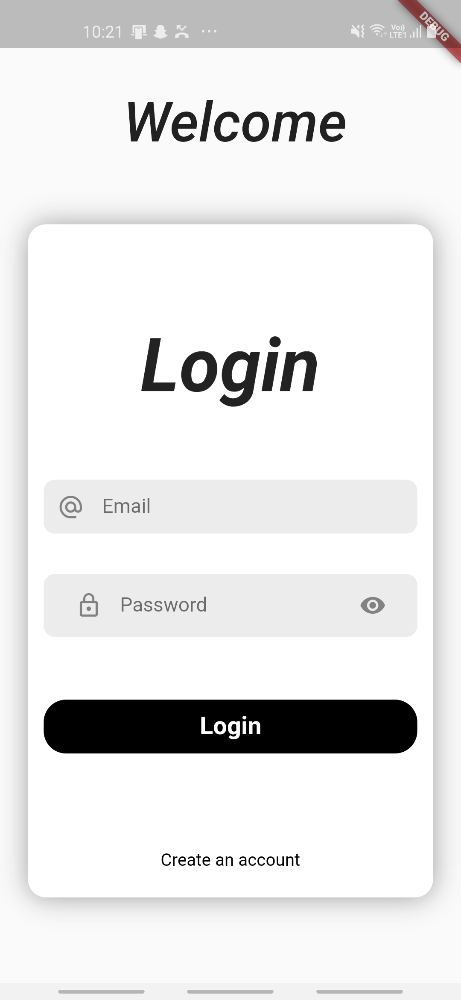
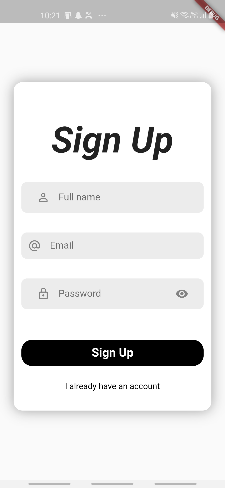
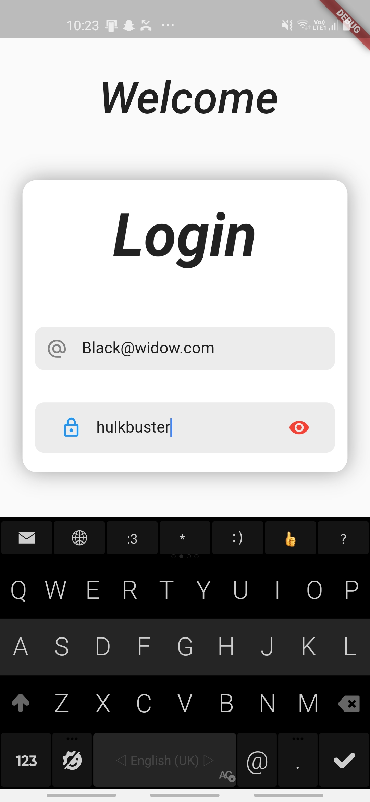
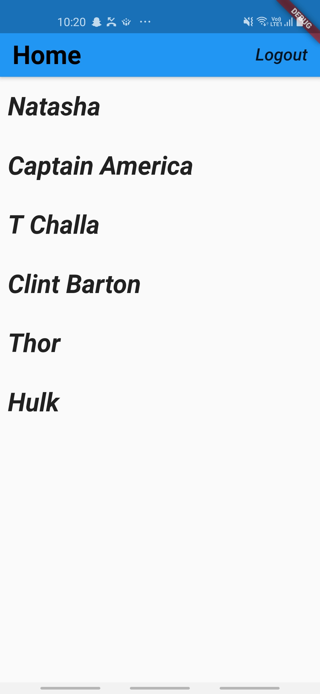

# flutterauthdemo

A  basic demo app which displays a list of registered users,excluding the currently logged in user.

Implements Firebase auth, cloud Firestore and provider package.

some login credentials: 
* black@widow.com : hulkbuster
* tonystark@stark.com : ironman
* hulk@hulk.com : natahsa
* black@panther.com : wakanda

## screenshots:

  
   
  
  

 
